# cinemo-react

This project is an evolution of the original PHP-based [Cinemo](https://github.com/Stephen0623/DWD_cw) movie recommendation web app, refactored with a modern tech stack. Currently in development, the focus is on building a robust system design using React, server-side rendering (SSR), Progressive Web App (PWA) capabilities, and other cutting-edge technologies.

## UI Designs

### Landing Page

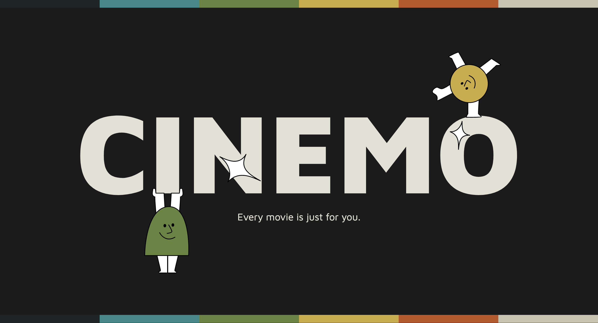

### Homepage

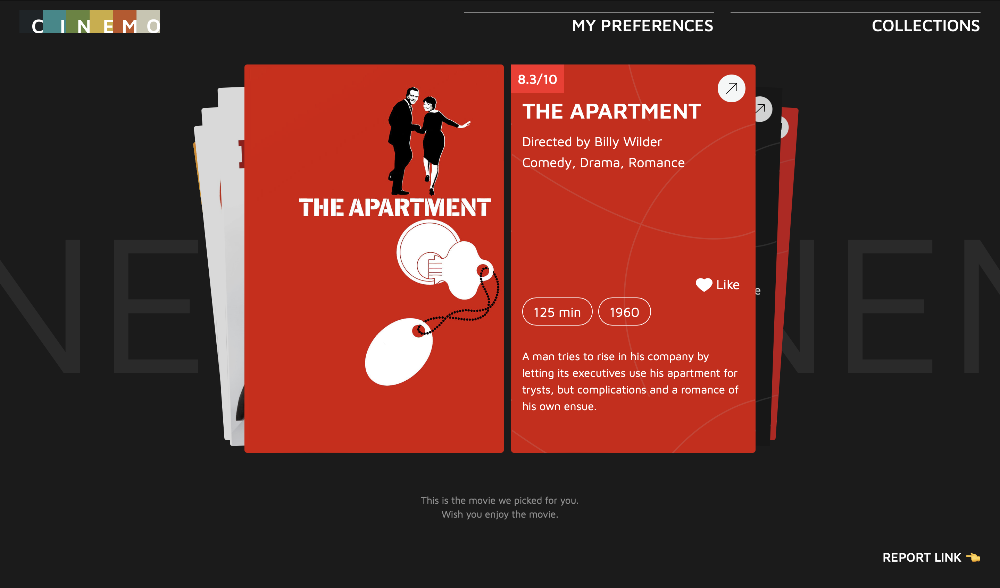
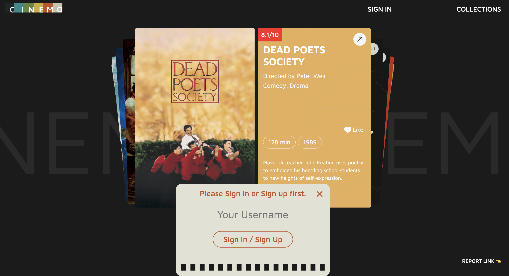


### Collections

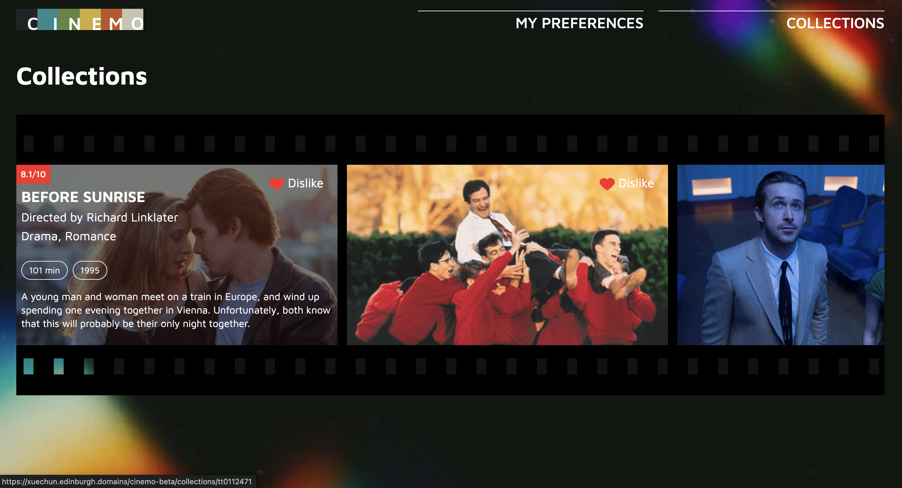
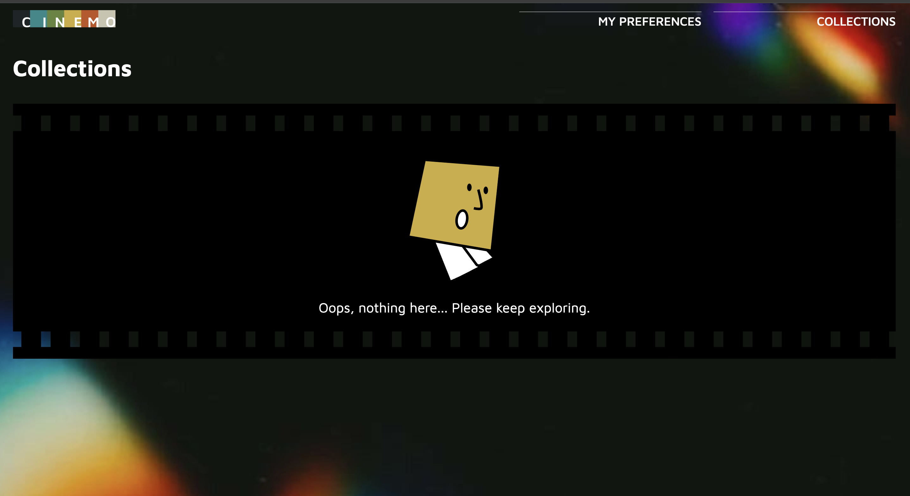

### Preferences

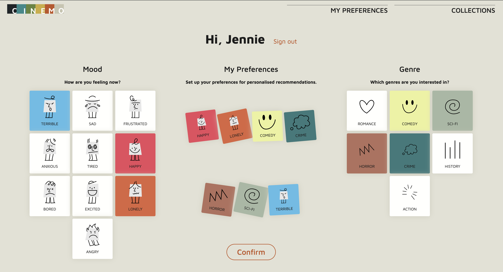


### Movie Details


### Responsive Layout

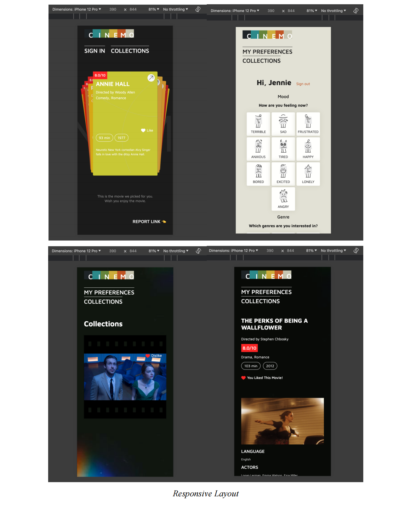

## Architecture Overview

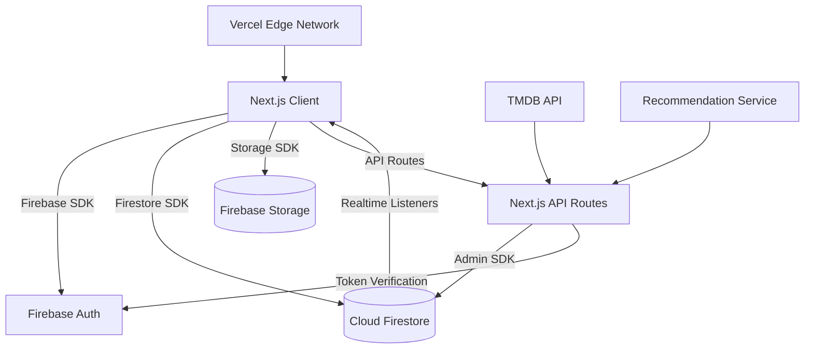

### Key Characteristics

- **Hybrid Rendering:** SSG for public pages, SSR for user-specific and dynamic content
- **Real-time Core:** Firestore listeners for collections/likes updates
- **Decoupled Services:** Firebase for stateful services, Vercel for deployment and edge functions
- **Progressive Enhancement:** PWA-first approach with network resilience
- **Edge Network:** Global CDN with Vercel's edge network
- **Security:** Built-in security headers and API route protection

## Project Structure

```shell
/cinemo-react
├── app/
│   ├── api/                   # Next.js API Routes
│   │   ├── tmdb/              # TMDB API proxy
│   │   ├── auth/              # Authentication endpoints
│   │   └── recommendations/   # Recommendation endpoints
│   ├── (auth)/                # Auth group layout
│   │   ├── signin/            # Sign-in page
│   │   └── signup/            # Sign-up page
│   ├── home/                  # Home page
│   ├── collections/           # Collections page
│   ├── preferences/           # Preferences page
│   ├── movie/                 # Movie details pages
│   └── layout.tsx             # Root layout
├── components/
│   ├── ui/                    # Reusable UI components
│   │   └── [Button/Input/Modal/etc]
│   ├── forms/                 # Form components
│   │   ├── auth/              # Authentication forms
│   │   └── preferences/       # Preference forms
│   └── features/              # Feature-specific components
│       └── [MovieCard/CollectionGrid/etc]
├── lib/
│   ├── firebase/              # Firebase configuration
│   └── tmdb/                  # TMDB API utilities
├── hooks/                     # Custom React hooks
├── stores/                    # State management (Zustand)
├── types/                     # TypeScript definitions
├── styles/                    # Global styles
└── public/                    # Static assets
```

### Key Technologies

- **Core:** Next.js 13+ (App Router), TypeScript
- **State:** Zustand (global), TanStack Query (data fetching)
- **Styling:** Tailwind CSS + Sass (utility-first + component-specific styles)
- **Deployment:** Vercel with Edge Functions
- **Database:** Firebase (Auth, Firestore, Storage)
- **API:** Next.js API Routes with rate limiting
- **Testing:** Jest, React Testing Library, Cypress
- **Analytics:** Vercel Analytics, Mixpanel

### Performance Features

- Image optimization with Next.js Image
- Route-based code splitting
- SWR for client-side caching
- Optimistic UI updates
- Edge network caching
- Automatic static optimization
- Incremental Static Regeneration (ISR)

### Security Features

- Secure headers configuration
- API route protection
- Firebase Security Rules
- Rate limiting
- CORS policies
- Environment variable protection

## Styling Architecture

### CSS Modules with Sass Integration

This project uses a hybrid approach combining CSS Modules with Sass for optimal component styling:

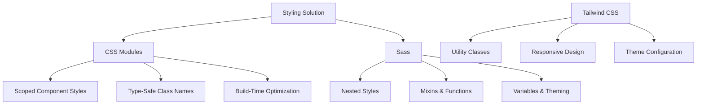

### Directory Structure

```
/styles/
├── globals.scss           # Global styles and Tailwind imports
├── _variables.scss        # Sass variables
├── _mixins.scss           # Sass mixins
/components/
├── MovieCard/
│   ├── MovieCard.tsx      # Component logic
│   ├── MovieCard.module.scss  # Component-specific styles
│   └── index.ts           # Export file
├── Button/
│   ├── Button.tsx
│   ├── Button.module.scss
│   └── index.ts
└── ...
```

### Key Features

1. **CSS Modules**

   - Scoped class names to prevent style conflicts
   - Type-safe class references in TypeScript
   - Co-located styles with components
   - Build-time optimization for smaller CSS bundles

2. **Sass**

   - Nested styles for better organization
   - Mixins for reusable patterns
   - Variables for theming
   - Mathematical operations
   - BEM naming convention support

3. **Tailwind CSS**

   - Utility-first approach for rapid development
   - JIT (Just-In-Time) compilation
   - Responsive design utilities
   - Dark mode support
   - Custom theme configuration

4. **Integration Benefits**
   - Use CSS Modules for component-specific styles
   - Use Sass for complex styling patterns and organization
   - Use Tailwind for layout and utility classes
   - Leverage Tailwind's @apply in Sass for consistency

### Best Practices

1. **Component-First Organization**

   - Place component styles in the same directory as the component
   - Use index.ts files for clean exports

2. **BEM Naming Convention**

   - Use Block\_\_Element--Modifier pattern in Sass files
   - Makes styles more readable and maintainable

3. **Global vs. Component Styles**

   - Use global styles for common elements (buttons, inputs)
   - Use component-specific styles for unique components

4. **Responsive Design**

   - Use mixins for responsive breakpoints
   - Apply responsive styles within component modules

5. **Performance Optimization**
   - Leverage CSS Modules' build-time optimization
   - Use Tailwind's JIT compiler for smaller CSS bundles

## Data & Storage

### Firestore Data Model

```javascript
// Users collection
users/${uid}
  ├─ preferences: {
  │    genres: string[],
  │    decade: "1990s" | "2000s",
  │    ratingThreshold: number
  │ }
  ├─ likes: subcollection[
  │    {
  │      movieId: string,
  │      timestamp: Date,
  │      metadata: TMDBMovie
  │    }
  │ ]
  └─ activity: {
       lastLogin: Date,
       totalLikes: number
     }
```

### Storage Solutions

1. **Firestore:** User data and preferences
2. **Firebase Storage:** User avatars
3. **LocalStorage:** Session caching
4. **Vercel Edge Cache:** TMDB images and API responses

### Data Validation

Zod schema validation:

```javascript
// Zod schema for Firestore documents
const UserPreferencesSchema = z.object({
  genres: z.array(z.string().max(20)),
  decade: z.enum(['1990s', '2000s', '2010s']),
  ratingThreshold: z.number().min(0).max(10),
})
```

## Backend & DevOps

### API Architecture

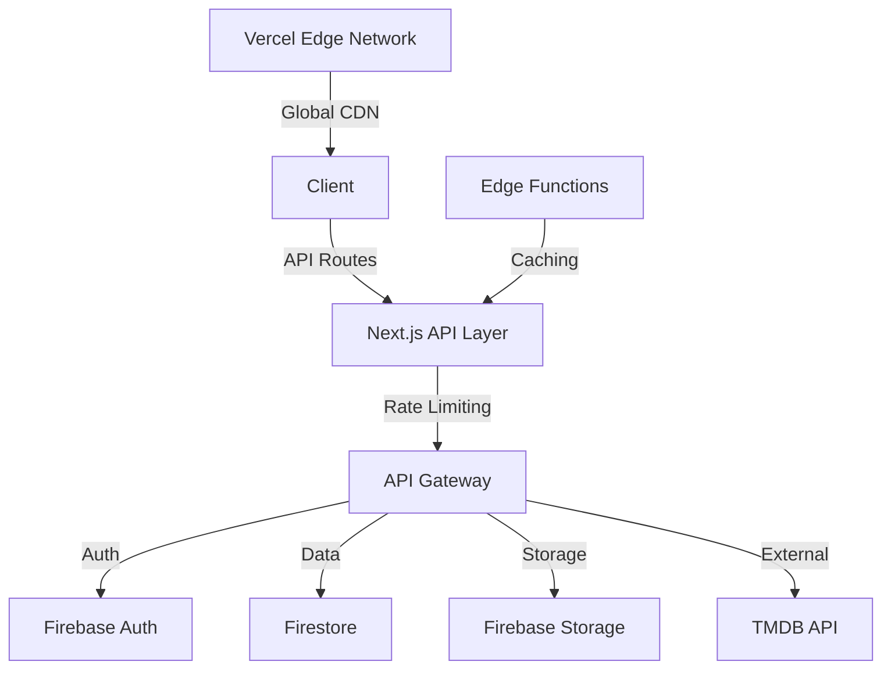

### CI/CD Pipeline

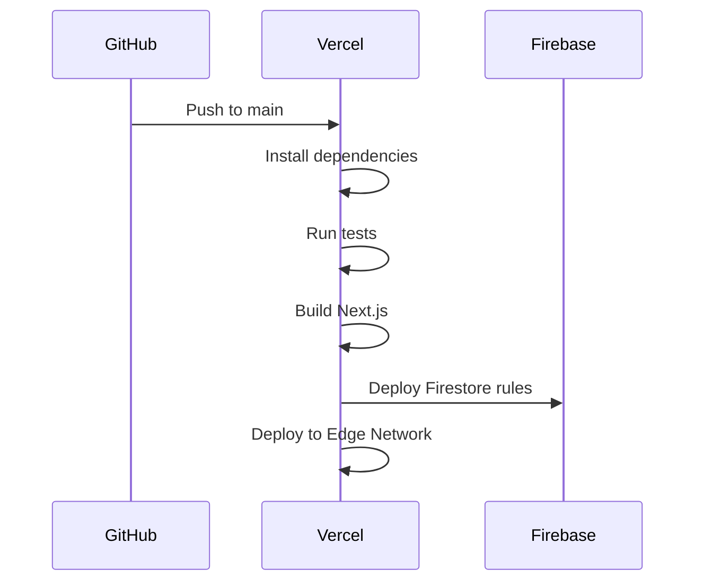

### Infrastructure Components

1. **Vercel Platform**

   - Edge Functions for serverless computing
   - Global CDN for static assets
   - Automatic HTTPS/SSL
   - Preview deployments for PRs
   - Analytics and monitoring

2. **Firebase Services**

   - Authentication with multiple providers
   - Firestore for real-time data
   - Cloud Storage for media
   - Security Rules for data protection

3. **API Layer**
   - Next.js API Routes for backend logic
   - Rate limiting and caching
   - Request validation
   - Error handling middleware

### Monitoring & Analytics

1. **Performance Monitoring**

   - Vercel Analytics for real-time metrics
   - Core Web Vitals tracking
   - Error tracking with Sentry
   - Custom event tracking with Mixpanel

2. **Security Monitoring**
   - Firebase Security Rules
   - API rate limiting
   - DDoS protection
   - Security headers

### Development Workflow

1. **Local Development**

   ```bash
   # Install dependencies
   npm install

   # Run development server
   npm run dev

   # Run tests
   npm run test

   # Type checking
   npm run type-check

   # Run lint
   npm run lint

   # Run format
   npm run format
   ```

2. **Deployment Process**

   ```bash
   # Build for production
   npm run build

   # Deploy to Vercel
   vercel deploy
   ```

3. **Environment Setup**

   ```bash
   # Create .env.local
   cp .env.example .env.local

   # Configure Firebase
   firebase login
   firebase init
   ```

## Additional Considerations

### AI-powered Recommendation Algorithm

(TODO)

### Accessibility Audit

- Screen reader testing with JAWS/NVDA
- Keyboard navigation checks
- Color contrast validation (WCAG 2.1 AA)
- ARIA landmarks verification

## References

- [Next.js Documentation](https://nextjs.org/docs) - learn about Next.js features and API.
- [Vercel](https://vercel.com/)
- [Firebase](https://firebase.google.com/)
- [ARIA](https://developer.mozilla.org/en-US/docs/Web/Accessibility/ARIA)
- [WCAG Guidelines](https://developer.mozilla.org/en-US/docs/Web/Accessibility/Understanding_WCAG)
- [TMDB API](https://developer.themoviedb.org/docs/getting-started)
