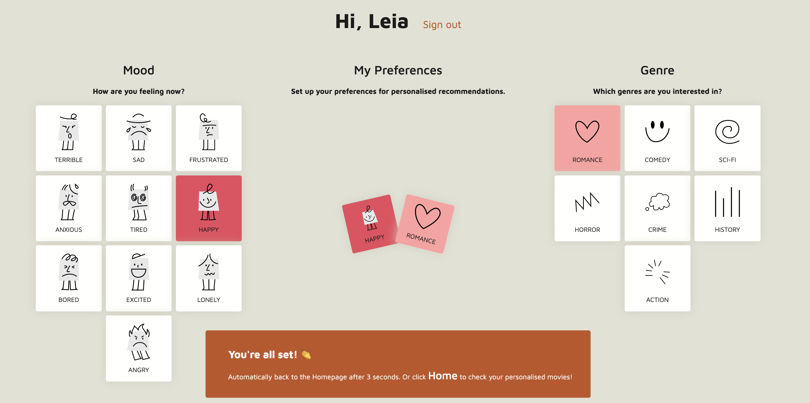

# cinemo-react

This is the [Cinemo](https://github.com/Stephen0623/DWD_cw) project refactored with React.

Cinemo is a movie recommendation website. Click 👉[here](https://xuechun.edinburgh.domains/cinemo-beta/) to visit.

## UI Designs

### Landing Page


### Homepage


### Collections


### Preferences




### Movie Details


### Responsive Layout


## Architecture Overview


### Key Characteristics:

- **Hybrid Rendering:** SSG for public pages, SSR for user-specific content
- **Real-time Core:** Firestore listeners for collections/likes updates
- **Decoupled Services:** Firebase for stateful services, Netlify for static hosting
- **Progressive Enhancement:** PWA-first approach with network resilience

------- Archive ---------

## UI & Frontend

Component Architecture:

```shell
/src
  /components      # Reusable UI (Button, MovieCard)
  /features        # Feature modules (Likes, Preferences)
  /layouts         # Page templates
  /pages           # Next.js routing
  /styles          # Tailwind config + global CSS
  /hooks           # Custom hooks (useAuth, useLikes)

```

### Key Technologies

- **Core:** Next.js (App Router), TypeScript
- **State:** Zustand (global), React Query (server-state)
- **Styling:** Tailwind + `styled-components` for dynamic theming
- **PWA:** `next-pwa` with runtime caching strategies

### Critical UI Flows

1. **Authentication Flow:** Email/password + social logins (low priority)
2. **Recommendation Engine:** Multi-filter browsing (mood and genres)
3. **Collection Management:** Drag-and-drop organisation
4. **Preference Editing:** Visual genre and mood selection

### Performance Features

- Image lazy loading with blur placeholders
- Route-based code splitting
- SWR for client-side caching
- Optimistic UI updates for likes/collections
- Mixpanel integration for tracking and analysing user behaviour

### Testing Strategy

- **Unit:** Jest + Testing Library
- **E2E:** Cypress with auth state reuse
- **Visual:** Percy snapshot testing
- **Lighthouse:** CI-based performance audits and Automated a11y checks

### Future Work

### Internationalization (i18n) Implementation

**Key Technologies:**

- `next-i18next` for SSR translations
- `i18next-browser-languagedetector` for auto language detection
- `date-fns` for localized date formatting
- `react-intl` for number/currency formatting

## Data & Storage

### Firestore Data Model

```javascript
// Users collection
users/${uid}
  ├─ preferences: {
  │    genres: string[],
  │    decade: "1990s" | "2000s",
  │    ratingThreshold: number
  │ }
  ├─ likes: subcollection[
  │    {
  │      movieId: string,
  │      timestamp: Date,
  │      metadata: TMDBMovie
  │    }
  │ ]
  └─ activity: {
       lastLogin: Date,
       totalLikes: number
     }
```

### External Data Integration

Public APIs

- TMDB API: [https://developer.themoviedb.org/docs/getting-started](https://developer.themoviedb.org/docs/getting-started)

```javascript
// TMDB API Adapter
export const fetchTMDBMovie = async (id: string) => {
	const res = await fetch(
		`https://api.themoviedb.org/3/movie/${id}?append_to_response=credits`,
		{
			headers: {
				Authorization: `Bearer ${process.env.TMDB_TOKEN}`,
			},
		}
	)
	return MovieSchema.parse(await res.json())
}
```

### Storage Solutions

1. **Firestore:** User-generated content
2. **Firebase Cloud Storage:** User avatars (with compression)
3. **LocalStorage:** Session caching for offline use
4. **CDN Cache:** TMDB images (via Netlify edge)

### Data Validation

Zod

```typescript
// Zod schema for Firestore documents
const UserPreferencesSchema = z.object({
	genres: z.array(z.string().max(20)),
	decade: z.enum(['1990s', '2000s', '2010s']),
	ratingThreshold: z.number().min(0).max(10),
})
```

## Backend & DevOps

### Netlify Functions Architecture

```shell
/netlify
  /functions
    recommendations.ts   # ML integration
    migration.ts         # Data import
    tmdb-proxy.ts        # API shielding
```

### CI/CD Pipeline


### Key Services

- **Netlify Edge:** Static asset delivery
- **Firebase Auth:** User identity
- **Firestore:** Real-time database
- **Cloud Functions:** Background tasks
- **Sentry:** Error monitoring

### Security Implementation

1. **CSP Headers:** Restrict script sources
2. **Firestore Rules:** Role-based access
3. **API Shield:** Netlify Functions proxy external APIs
4. **Secret Management:** Environment variables encryption

## Additional Considerations

### Recommendation Algorithm


### Implementation Strategy

1. Precompute daily recommendations via Cloud Run
2. Real-time personalization with TensorFlow.js
3. Fallback to TMDB similar movies API

### Accessibility Audit

- Screen reader testing with JAWS/NVDA
- Keyboard navigation checks
- Color contrast validation (WCAG 2.1 AA)
- ARIA landmarks verification
