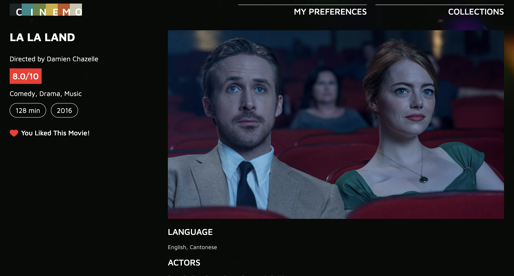

# cinemo-react

This is the [Cinemo](https://github.com/Stephen0623/DWD_cw) project refactored with React.

Cinemo is a movie recommendation website. Click 👉[here](https://xuechun.edinburgh.domains/cinemo-beta/) to visit.

## UI Designs

### Landing Page

### Homepage

### Collections

### Preferences

### Movie Details

### Responsive Layout

## Public APIs

TMDB API: [https://developer.themoviedb.org/docs/getting-started](https://developer.themoviedb.org/docs/getting-started)

## Storage

- MySQL
- Firebase Cloud Store
- LocalStorage

## Front-end

Using [Create React App](https://create-react-app.dev/docs/adding-typescript/) to set up the front-end codebase.

### React

TODO

### TypeScript

TODO:

### Styling

- Tailwind.CSS
- Styled-Components

TODO:

## Backend

TODO:

- Host with Firebase [docs](https://firebase.google.com/docs/auth/web/start)
  - Firebase Authentication
  - Cloud Store
- CI/CD
  - Netlify
- Refactor with Next.js vs Separated Backend Frameworks (Node.js (Express) / Go / Java)
